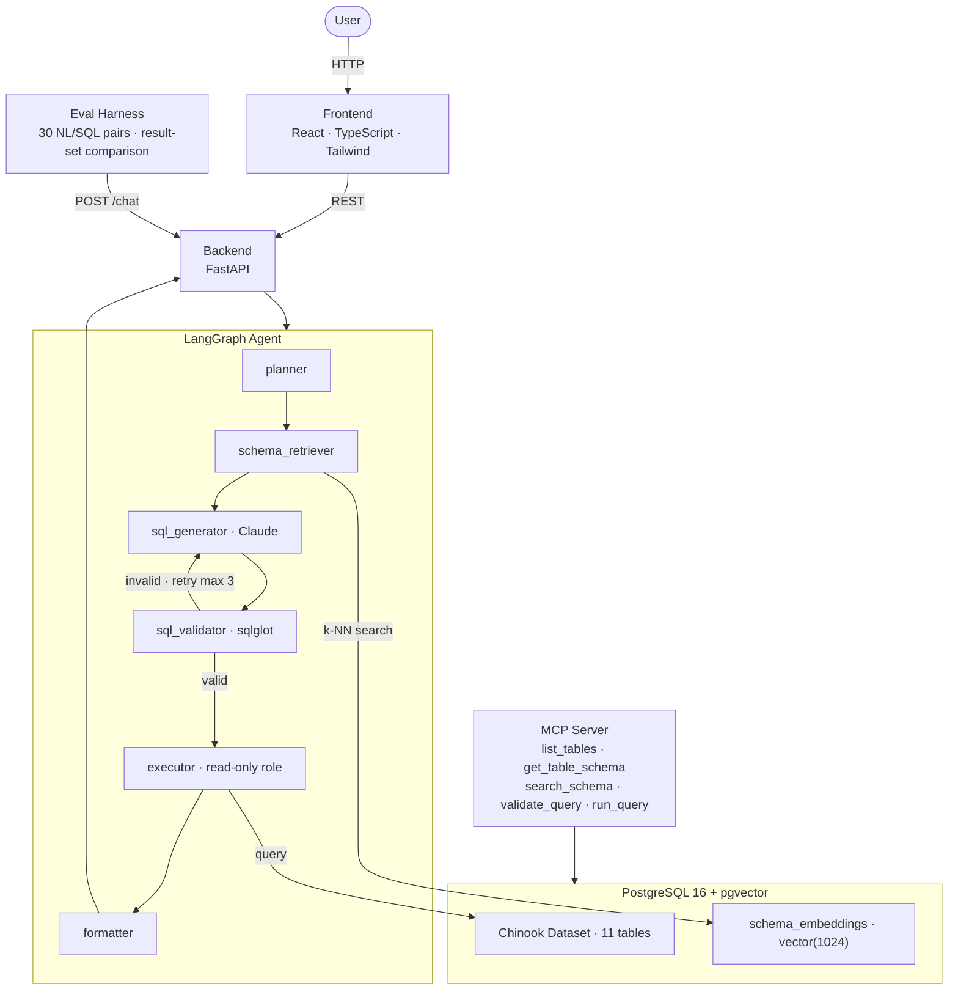

# QueryMind

A natural-language-to-SQL agent with semantic schema retrieval, safety guardrails,
and a self-correction loop. Ask a question in plain English; get back a SQL query,
the result, and a full reasoning trace.



## Tech Stack

| Layer | Technology |
|---|---|
| Backend | Python 3.11, FastAPI, uvicorn |
| Agent | LangGraph, Anthropic Claude (via Anthropic SDK) |
| SQL validation | sqlglot |
| Embeddings | Voyage AI voyage-3 (1024 dims) |
| Database | PostgreSQL 16 + pgvector extension |
| MCP | Official Python MCP SDK |
| Frontend | React 18, TypeScript, Vite, Tailwind CSS |

> **Embedding model choice:** The spec uses Anthropic Claude for generation.
> Voyage AI (a close Anthropic partner) is the natural embedding choice —
> voyage-3 outperforms OpenAI ada-002 on retrieval benchmarks and integrates
> cleanly with the Anthropic ecosystem. Swap to any other 1024-dim model by
> updating `EMBEDDING_MODEL` in `.env`.

## Quick Start

### Prerequisites

- Docker + Docker Compose
- Python 3.11+
- `ANTHROPIC_API_KEY` — get one at console.anthropic.com
- `VOYAGE_API_KEY` — get one at voyageai.com (used in Phase 2)

### 1 — Configure

```bash
cp .env.example .env
# Open .env and add your ANTHROPIC_API_KEY (and VOYAGE_API_KEY for Phase 2)
```

### 2 — Start Postgres

```bash
make up
```

### 3 — Seed Chinook data

```bash
make seed
```

This downloads the official Chinook PostgreSQL dataset (~3 500 tracks, 275
artists, 347 albums) and seeds it into the local container.  It also creates
the `querymind_ro` read-only role used for all user-facing queries.

### 4 — Start the backend

```bash
make backend
# → http://localhost:8000
# → http://localhost:8000/docs  (Swagger UI)
```

### Useful commands

```bash
make psql     # Open a psql shell in the container
make logs     # Tail Postgres logs
make clean    # Stop and wipe all Docker volumes (fresh start)
```

## Directory Layout

```
QueryMind/
├── docker-compose.yml       # Postgres 16 + pgvector
├── .env.example             # Required environment variables
├── Makefile                 # Convenience targets
│
├── db/
│   ├── init/
│   │   ├── 01_extensions.sql       # CREATE EXTENSION vector
│   │   ├── 02_roles.sql            # querymind_ro read-only role
│   │   └── 03_schema_embeddings.sql# pgvector table (Phase 2)
│   ├── seed.py                     # Download + apply Chinook dataset
│   └── requirements.txt
│
├── backend/
│   ├── app/
│   │   └── main.py                 # FastAPI app
│   ├── tests/
│   └── requirements.txt
│
├── mcp_server/
│   ├── server.py                   # MCP tool definitions (Phase 3)
│   └── requirements.txt
│
├── eval/
│   ├── eval_set.json               # 30 NL/SQL test cases (Phase 4)
│   ├── run_eval.py                 # Evaluation harness (Phase 4)
│   └── requirements.txt
│
└── frontend/                       # React app (Phase 5)
```

## Database: Chinook Schema

11 tables covering a digital music store:

| Table | Description |
|---|---|
| `Artist` | Music artists |
| `Album` | Albums linked to an artist |
| `Track` | Individual tracks with duration, price, genre |
| `Genre` | Music genre lookup |
| `MediaType` | File format lookup |
| `Playlist` | User playlists |
| `PlaylistTrack` | Many-to-many: playlists ↔ tracks |
| `Customer` | Customer records with location |
| `Employee` | Employees (supports manager hierarchy) |
| `Invoice` | Purchase invoices per customer |
| `InvoiceLine` | Line items linking invoice to track |

Plus `schema_embeddings` (added by QueryMind for semantic retrieval).

## Security Design

| Layer | Control |
|---|---|
| Database | `querymind_ro` role — SELECT only, no DDL or DML |
| SQL validator | sqlglot parse; reject anything that isn't a SELECT |
| Executor | Statement timeout + row limit enforced at connection level |
| Logging | Every query attempt logged, including blocked ones |

## Build Phases

| Phase | Status | Scope |
|---|---|---|
| **0** | ✅ Done | Project scaffold, Docker, Chinook seed, read-only role |
| **1** | 🔲 Next | `POST /chat` — single-pass pipeline (full schema dump → Claude → SQL → answer) |
| **2** | 🔲 | LangGraph agent: planner → schema_retriever → sql_generator → validator → executor → formatter; self-correction loop (max 3 retries) |
| **3** | 🔲 | MCP server — 5 tools exposed via Python MCP SDK |
| **4** | 🔲 | Guardrails + eval harness (30 test cases, result-set comparison) |
| **5** | 🔲 | React frontend — chat UI + expandable agent trace panel |
